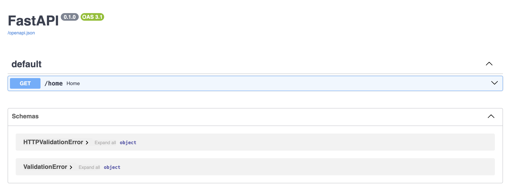

### Installation

To install the package, run the following command:

```bash
pip install richapi
```

## Help

See [documentation](https://manimozaffar.github.io/richapi/latest/) for more details.

### Use Cases

RichAPI is designed to simplify FastAPI projects by automatically generating documented HTTP responses from HTTPException without extra effort! 🎉

This project is inspired and completer version of [Kludex's Fast-Response project](https://github.com/Kludex/fastapi-responses)
This package is planned to have more features for now that might be essential for any FastAPI project later.

What would you see WITHOUT RichAPI:


After compiling OpenAPI WITH RichAPI (extended with all possible exceptions coming from your router):

