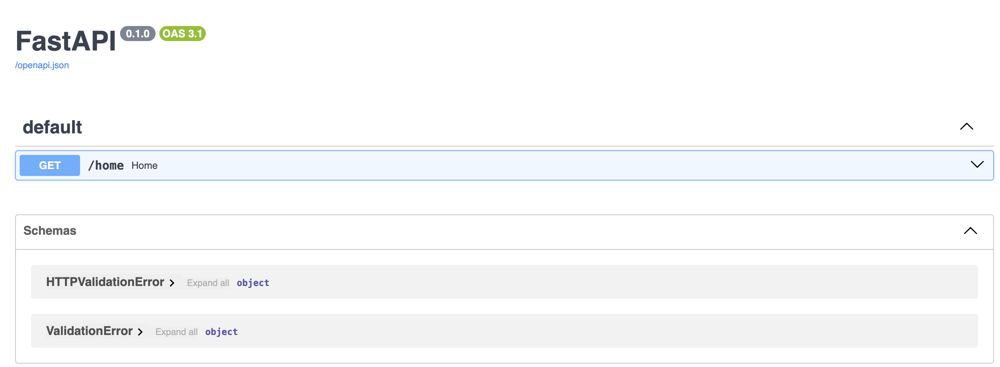
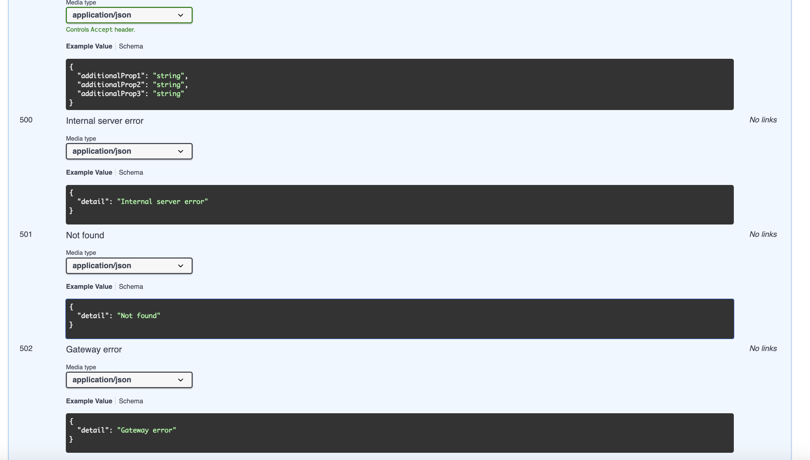

### Installation

To install the package, run the following command:

```bash
pip install richapi
```

### Usage

RichAPI is designed to simplify FastAPI projects by automatically generating documented HTTP responses from HTTPException without extra effort! 🎉

This package is planned to have more features for now that might be essential for any FastAPI project later.

There are multiple way you can do that,
first way is simply to regenerate the OpenAPI schema by running the following command:

```python
from richapi import enrich_openapi
from fastapi import FastAPI

app = FastAPI()
# add your routers ....
app.openapi = enrich_openapi(app)
```

You can also compile the OpenAPI schema and save it to a file, by running this command from CLI:

```bash
richapi compile module.app:app
```

And then, you can run the following code to load the compiled OpenAPI schema:

```python
from richapi import load_openapi
from fastapi import FastAPI

app = FastAPI()

with open("openapi.json") as open_api_json:
    app.openapi = load_openapi(app, json.loads(open_api_json.read()))
```

!!! hint "My recommended way"

    I personally recommend the second way, because it is better to have it compiled and saved to file, because there are static analysis running on the OpanAPI generator and your source code which isn't very ideal to be running in production.

### Customization of Exception

Sometimes, your exceptions is more than 'details'. You may want to put some extra information for the client to understand and parse the error better. In that case, please follow these steps:

1. Add the exception handler from richapi to your FastAPI app.
2. Inhert from `richapi.RichHTTPException`, and make it a dataclass.
3. To override status, simply set the `status_code` attribute on the class without type annotation.
4. Raise that exception somewhere in your code and you'll see the schema on swagger!

Example:

```python
import fastapi
import fastapi.security
from pydantic import BaseModel
from pydantic.dataclasses import dataclass

from richapi.exc_parser.handler import add_exc_handler
from richapi.exc_parser.openapi import enrich_openapi
from richapi.exc_parser.protocol import RichHTTPException

app = fastapi.FastAPI()
app.openapi = enrich_openapi(app)
add_exc_handler(app)


@dataclass
class NotEnoughBalance(RichHTTPException):
    """Custom exception for user balance"""

    user_id: int
    balance: float
    status_code = 403


class SuccessResponse(BaseModel):
    balance: float


@app.post("/payment")
async def make_payment() -> SuccessResponse:
    raise NotEnoughBalance(user_id=1, balance=0.5)
```

Final Result:


### Conventions (VERY IMPORTANT)

There are some conventions about how to raise exceptions and etc. You may read the [conventions](conventions.md) to know more about them. The way library works is that it is a mini compiler using Abstract Syntax Tree and functions global to extract exceptions and their responses, and then it generates the OpenAPI schema from them. So there are limitations to what it can do, and you may need to follow the conventions to get the best out of it. Anything that is not following the conventions MAY be ignored by the compiler, and there is no plan to support them in the future, because it is not possible to support all the ways you can raise exceptions in Python... To give you an example, you may download a source code from internet and then use 'eval' function to run it dynamically, and there is no way to know what exceptions you may raise in that code, so it is impossible to support all the ways you can raise exceptions in Python.

### Example

Imagine this application;

```python
import random

from fastapi import FastAPI

from richapi.exc_parser.openapi import compile_openapi_from_fastapi, enrich_openapi
from richapi.exc_parser.protocol import BaseHTTPException

app = FastAPI()
app.openapi = enrich_openapi(app)


class InteralServer(BaseHTTPException):
    status_code = 500
    detail = "Internal server error"


class NotFound(BaseHTTPException):
    status_code = 501
    detail = "Not found"


class GatewayError(BaseHTTPException):
    status_code = 502
    detail = "Gateway error"


def very_nested():
    value = InteralServer
    raise value


def nested():
    try:
        very_nested()
    except InteralServer:
        raise NotFound


@app.get("/home")
def read_root() -> dict[str, str]:
    if random.choice([True, False]):
        nested()

    elif random.choice([True, False]):
        raise GatewayError()

    return {"Hello": "World"}
```

What would you see WITHOUT RichAPI:


After compiling OpenAPI WITH RichAPI (extended with all possible exceptions coming from your router):

